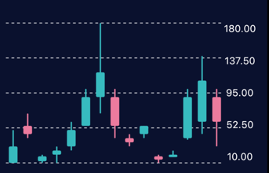
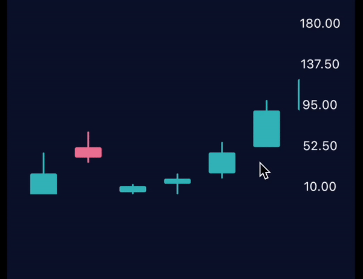

## Flutter candlesticks

An elegant Flutter candlesticks chart

## Example

### Non scrollable chart

```dart
    const style = CandlestickChartStyle(
        yLegendStyle: CandlestickChartYLegendStyle(
            textStyle: TextStyle(color: Colors.white),
            numberOfLabels: 5,
            lineStyle: CandlestickChartDashedLineStyle(width: 1, color: Colors.white)),
        candlestickStyle: CandlestickStyle(bullishColor: Color(0xFF38bbbf), bearishColor: Color(0xFFed7b9e)),
        candlestickSelectedStyle: CandlestickStyle(bullishColor: Color(0xff25787b), bearishColor: Color(0xff9d4963)));
    
    CandlesticksChart<CandleModel>(
        height: 200,
        data: data,
        style: style,
        getHightCallback: (e) => e.hight,
        getCloseCallback: (e) => e.close,
        getLowCallback: (e) => e.low,
        getOpenCallback: (e) => e.open,
        getTimeCallback: (e) => e.date,
    )
```



### Scrollable chart

```dart
    const style = CandlestickChartStyle(
      yLegendStyle: CandlestickChartYLegendStyle(
      textStyle: TextStyle(color: Colors.white),
      numberOfLabels: 5,
      lineStyle: CandlestickChartLineStyle(width: 1, color: Colors.white)),
      candlestickStyle: CandlestickStyle(bullishColor: Color(0xFF38bbbf), bearishColor: Color(0xFFed7b9e)),
      candlestickSelectedStyle: CandlestickStyle(bullishColor: Color(0xff25787b), bearishColor: Color(0xff9d4963))
    );

    CandlesticksChart<CandleModel>(
      height: 200,
      data: data,
      style: style,
      options: const CandlestickChartOptions(isScrollable: true),
      getHightCallback: (e) => e.hight,
      getCloseCallback: (e) => e.close,
      getLowCallback: (e) => e.low,
      getOpenCallback: (e) => e.open,
      getTimeCallback: (e) => e.date,
    )
```

